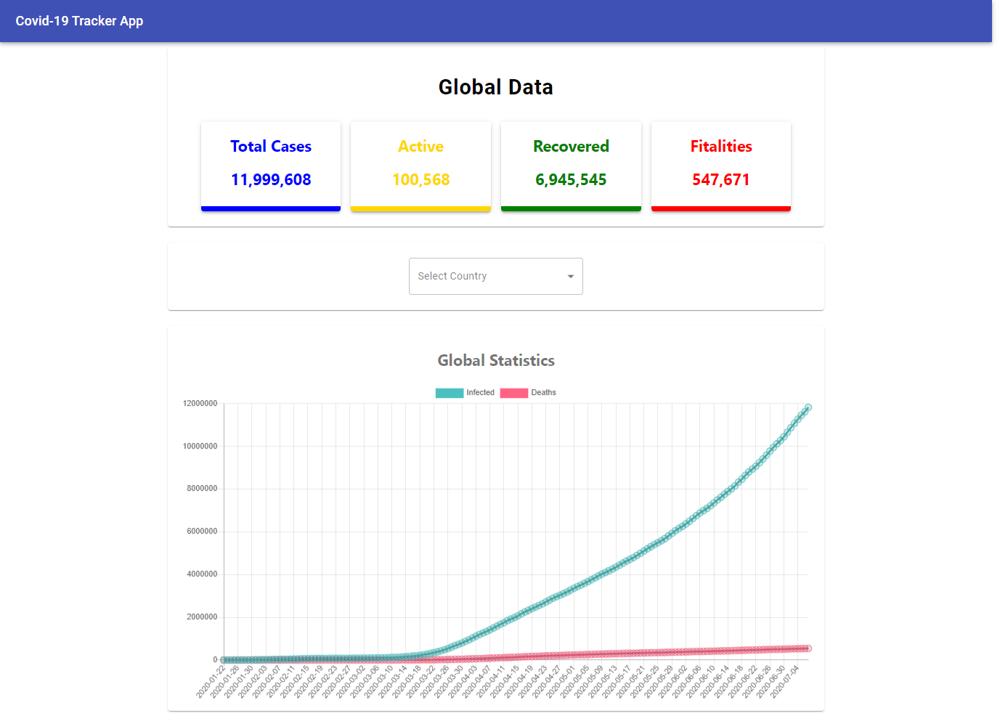

## Available Scripts

Run npm install to install the dependencies.

### `npm install`

Then start the application:

### `npm start`

Here's a look of application:

Global Data with global graph statistics:

Coutry wise data with graph statistics:
